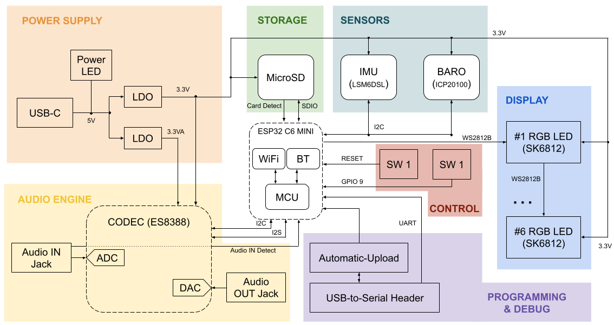

# Hardware Design
## Board ID - Development V0


# Software Architecture

The software stack can be split between the following tasks:
## 1. SensorTask
Responsible with initializing, managing, collecting and processing sensor data. Pushes each new reading to the ***shared_data_buffer***. 
Uses the ***SensorHAL*** virtual layer, as implemented into ***specific_sensor_HAL*** to standardize high-level I/O across all sesnors.
### States
* **BOOT** - default state on boot-up; transition to INIT triggered from main.cpp
* **INIT** - initializes I2C bus for comms to sensors, configures and confirms communications to sensors
* **READ** - captures one sample for each sensor value. New, raw values are pushed to the ***shared_data_buffer***.
* **PROCESS** - post-processing required to obtain associated values *(ex. acceleration is integrated once to obtain velocity)*
* **SLEEP** - the state machine waits in this state until a new **READ->PROCESS** cycle is started
## 2. EvaluatorTask
Responsible for gauging player effort. The EvaluatorTask owns multiple instances of the abstract base class ***EvaluatorBase***. 
EvaluatorBase standardizes I/O across all evaluators, such as ***DisplaySessionEvaluator*** (which captures aggregate statistics on sensor data while a specific ***DisplayTask*** mode is showing).
### States
* **BOOT** - default state on boot-up; transition to INIT triggered from main.cpp
* **INIT** - initializes and confirms appropriate logging is setup for all evaluators
* **RUNNING** - checks progress on all evaluators, and allows access to the SDManager cue
* **ERROR** - NOT IMPLEMENTED
## 3. DisplayTask
Manages the primary user feedback tool - a chain of NeoPixel RGB LEDs organized across three zones: 
* 3 LEDs for conveying DisplayState - tells the user what quantities are being measured & additional device info
* 3 LEDs for conveying scalar values and magnitudes of vector quantities
* 3 LEDs for conveying qualitative cartesian components for vector quantities magnitudes

A push-button is used to cycle through DisplayStates. A set of aggregateStats (belonging to ***shared_data_buffer*** is reset every time DisplayState is cycled)
### States
* **BOOT** - default state on boot-up; transition to INIT triggered from main.cpp
* **INIT** - initializes the RGB LED strip and displays a color code for the GIT SHA (used to confirm proper code in use)
* **DISPLAY_PRESSURE** - reads the last pressure value from ***shared_data_buffer*** and displays it using a color code
* **DISPLAY_ACCEL** - NOT IMPLEMENTED
* **DISPLAY_SENSOR*** - multiple DisplayStates to be added for new sensors and physical quantities measured

## 4. SDManager
Owns operation of the microSD card. It manages access to the resource using a separate state machine.
### States
* **BOOT** - default state on boot-up; transition to INIT automatically after initializing SD cue
* **WAIT_FOR_INSERT** - checks and debounces the state of the SD detect GPIO
* **MOUNTING** - starts SPI communications, mounts the SD card & checks SD card metadata
* **READY** - allows fulfillment of read/write requests in the cue
* **UNMOUNTING** - unnmounts the SD card if detected removed
* **ERROR** - NOT IMPLEMENTED

# SD Card Formatting
In order to read and write to the SD card, it has to be formatted to **FAT32** and **MBR**. Insert the microSD card into a compatible card reader, connect to a Linux machine, and locate it using the following Terminal command: use a Terminal to:
```bash
lsblk
``` 
Then, in a Terminal, using its ***/dev/sdX*** identity:
```bash
sudo umount /dev/sdX*
sudo wipefs --all /dev/sdX
sudo fdisk /dev/sdX
``` 
Within ***fdisk***, configure the following proerties:
* Press ***o*** → create a new DOS (MBR) partition table 
* Press ***n*** → create a new primary partition
* Accept all defaults
* Press ***t***, then type ***c*** → change type to W95 FAT32 (LBA)
* Press ***w*** → write changes

Finally, format to FAT32 using:
```bash
sudo mkfs.vfat -F 32 -n SDCARD /dev/sdX1
``` 