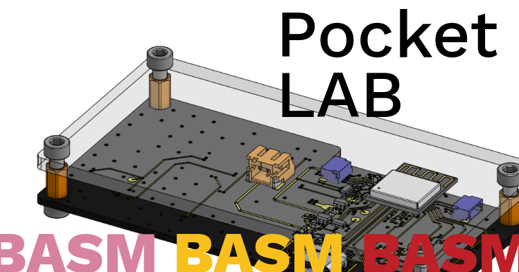
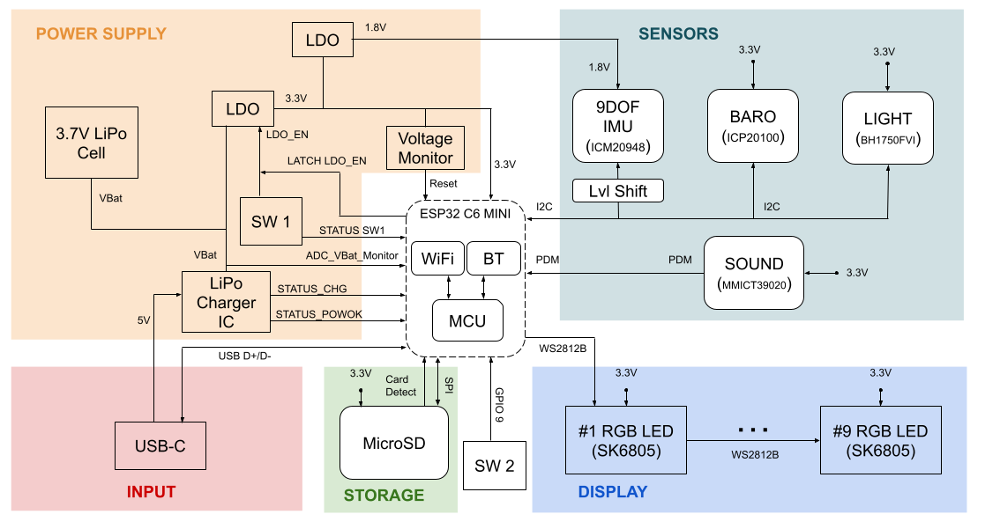

# Introduction
The Pocket Lab is the next generation approach to Science Labs. It is designed by the Bucharest Applied STEAM Museum to bring scientific exploration into anyones' hands. From citizen science projects and fearless (guided or individual)  exploration, the Pocket Lab brings to life the connections between Science, Technology, Engineering, Art & Math in the world around. 




# Hardware Design
The system is built around an ESP32 C6 MINI microcontroller. It's powerful, features great connectivity through WiFi and Bluetooth and integrates very well with accessible codebases through Arduino.
The microcontroller collects data from a suite of sensors (9 DOF IMU, light, pressure etc.) and uses a chain of WS2812B RGB LEDs to relay measurements to the user. An on-board microSD card can be used for logging or automated-grading of student work.
Everything is powered by a 3.7V LiPo cell, which is charged using the USB-C connector.
## Board ID - Education V0


### Power
The power stage is designed for a 500 mAh 3.7V LiPo cell. The charger IC is configured to supply 450 mA in the constant-current regime and stops charging when the current drops below 150 mA in the constant-voltage regime. 
Since the USB-C power supply is non-negotiated, it is limited to supplying 5V at 500 mA, which is sufficient for the configuration described above. 
A Voltage Monitor is used to avoid brown-out bevavior on the ESP32 when the voltage on the 3V3 rail drops below 2.9V.
Finally, a simple circuit is used to enable and latch the LDO through a push-button (SW 1) and a GPIO on the ESP32. 

### Sensors
For the Pocket Lab EDU V0, the sensors and their respective measurements are listed below:
* **ICM-20948** - 9DOF IMU measuring translational acceleration, rotational velocity & magnetic field strength
* **ICP-20100** - Ambient Temperature & Air Pressure
* **BH1750FVI** - Ambient Light
* **MMICT390200012** - Microphone (dB & sound)

### Programming
 The MCU can be programmed through Joint download boot mode. To enter this mode, first connect the Pocket Lab to a host computer using a USB-C data cable. Then, hold down SW 2 (labeled "MOD"; connected to GPIO 9), hold down SW 1 (labeled "ON/OFF"), and finally release SW 2. The USB-serial connection is named tty/ACMx and it allows PlatformIO to flash code to the ESP32 C6.

# Software Architecture

The software stack can be split between the following tasks:
## 1. SensorTask
Responsible with initializing, managing, collecting and processing sensor data. Pushes each new  raw reading to the ***shared_data_buffer***. 
Uses the ***SensorHAL*** virtual layer, as implemented into ***specific_sensor_HAL*** to standardize high-level I/O across all sesnors.
### States
* **BOOT** - default state on boot-up; transition to INIT triggered from main.cpp
* **INIT** - initializes I2C bus for comms to sensors, configures and confirms communications to sensors
* **READ** - if a sensor is ready to read (each sensor has an individual read_rate_Hz), capture a raw reading, and commits it to the last frame of ***shared_data_buffer***.
* **PROCESS** - **[NOT IMPLEMENTED]** 
* **SLEEP** - **[NOT IMPLEMENTED]** 
## 2. EvaluatorTask
Responsible for gauging player effort. The EvaluatorTask owns multiple instances of the abstract base class ***EvaluatorBase***. 
EvaluatorBase standardizes I/O across all evaluators, such as ***DisplaySessionEvaluator*** (which captures aggregate statistics on sensor data while a specific ***DisplayTask*** mode is showing).
### States
* **BOOT** - default state on boot-up; transition to INIT triggered from main.cpp
* **INIT** - initializes and confirms appropriate logging is setup for all evaluators
* **RUNNING** - checks progress on all evaluators, and allows access to the SDManager cue
* **ERROR** - NOT IMPLEMENTED
## 3. DisplayTask
Manages the primary user feedback tool - a chain of NeoPixel RGB LEDs organized across three zones: 
* 2 LEDs - **Mode Display** - color code for quantity actively displayed (WH|Light ; MAGENTA|Sound ; YLW|Magnets ; GRN|Accel ; ORNG|Gyro ; RED|AirTemp ; BLUE|AirPress) & additional device info (i.e Battery State)
* 3 LEDs - **Magnitude Display** - conveys scalar values and magnitudes of vector quantities
* 3 LEDs - **Direction Display** - conveys qualitative cartesian components for vector quantities (Please note that the Direction Display is only available in the **Binary Mode** - ***see below for more***)

A push-button (display mode button) is used to cycle through DisplayStates. A set of aggregateStats (belonging to ***shared_data_buffer*** is reset every time DisplayState is cycled)
### States
* **BOOT** - default state on boot-up; transition to INIT triggered from main.cpp
* **INIT** - initializes the RGB LED strip and displays a color code for the GIT SHA (used to confirm proper code in use)
* **DISPLAY_XX** - reads the last value for the XX quantity from  ***shared_data_buffer*** and displays it 

### Modes
The DisplayTask supports two distinct visualization modes selected at boot time by holding (or not holding) the display mode button:
VU_DISPLAY Mode (Traditional)

**VU mode** provides a classic "volume unit" meter visualization reminiscent of analog audio equipment. In this mode, scalar measurements are displayed as a horizontal bar graph using 6 magnitude LEDs. The display shows the normalized percentage of the measurement relative to predefined min/max thresholds for each sensor type.

The magnitude LEDs use a gradient color scheme that transitions smoothly from green (low values) through yellow (mid-range) to red (high values), providing an intuitive visual indication of intensity. The more LEDs that are lit, the closer the measurement is to its maximum threshold. Vector quantities in VU mode do not display directional information - only their magnitude is shown.
BINARY_DISPLAY Mode (Integer Encoding)

**Binary mode** takes a fundamentally different approach by encoding the actual integer value of measurements rather than showing a percentage. This mode provides precise numerical information that can be decoded by reading the LED colors, making it particularly useful for debugging and data verification.

The system uses 4 magnitude LEDs to encode 12-bit values (0-4095) using a novel 3-bit-per-LED color encoding scheme:

How the Binary Encoding Works:

Each RGB LED encodes 3 bits of information using its individual color channels:

    Blue channel = Bit m (LSB for that LED)
    Yellow channel = Bit m+1 (middle bit)
    Red channel = Bit m+2 (MSB for that LED)

The LEDs are arranged from left to right, with LED #1 (leftmost) showing bits 0-2, LED #2 showing bits 3-5, LED #3 showing bits 6-8, and LED #4 (rightmost) showing bits 9-11. This arrangement means that more LEDs being lit indicates a larger magnitude.

Color Combinations: The 3 bits per LED create 8 possible states (0-7), each displayed as a distinct color:

    000 → OFF
    001 → BLUE (bit 0 only)
    010 → YELLOW (bit 1 only)
    011 → GREEN (bits 0+1: blue+yellow = green)
    100 → RED (bit 2 only)
    101 → PURPLE (bits 0+2: blue+red = purple)
    110 → ORANGE (bits 1+2: yellow+red = orange)
    111 → WHITE (all three bits active)

Example: To encode the value 1059:

    1059 in binary = 0100 0010 0011 = 2^0 + 2^1 + 2^5 + 2^10
    LED #1 (bits 0-2 = 011): Blue + Yellow = GREEN
    LED #2 (bits 3-5 = 100): Red only = RED
    LED #3 (bits 6-8 = 000): All off = OFF
    LED #4 (bits 9-11 = 100): Yellow only = YELLOW

Before encoding, sensor readings are multiplied by sensor-specific scaling factors (defined as BINARY_MAG_ORDER_* constants) to convert floating-point measurements into integer values. For example, temperature is multiplied by 10, so 25.3°C becomes 253, while pressure is multiplied by 10, converting 101.32 kPa to 1013  (then clamped to 4095). Please note that acceleration, gyro measurements are very noisy and flicker a lot; as such, the first two bits are masked, effectively rounding every measurement to a multiple of 4.

Direction Display:

Binary mode also displays vector components (X, Y, Z) using 3 dedicated direction LEDs. Each LED shows its component using a color gradient:

    RED → negative values
    OFF → near-zero values (±5% dead zone)
    GREEN → positive values

The intensity of the color fades proportionally with the component's magnitude, providing both sign and strength information. 


## 4. SDManager
Owns operation of the microSD card. It manages access to the resource using a separate state machine.
### States
* **BOOT** - default state on boot-up; transition to INIT automatically after initializing SD cue
* **WAIT_FOR_INSERT** - checks and debounces the state of the SD detect GPIO
* **MOUNTING** - starts SPI communications, mounts the SD card & checks SD card metadata
* **READY** - allows fulfillment of read/write requests in the cue
* **UNMOUNTING** - unnmounts the SD card if detected removed
* **ERROR** - NOT IMPLEMENTED

# SD Card Formatting
In order to read and write to the SD card, it has to be formatted to **FAT32** and **MBR**. Insert the microSD card into a compatible card reader, connect to a Linux machine, and locate it using the following Terminal command: use a Terminal to:
```bash
lsblk
``` 
Then, in a Terminal, using its ***/dev/sdX*** identity:
```bash
sudo umount /dev/sdX*
sudo wipefs --all /dev/sdX
sudo fdisk /dev/sdX
``` 
Within ***fdisk***, configure the following proerties:
* Press ***o*** → create a new DOS (MBR) partition table 
* Press ***n*** → create a new primary partition
* Accept all defaults
* Press ***t***, then type ***c*** → change type to W95 FAT32 (LBA)
* Press ***w*** → write changes

Finally, format to FAT32 using:
```bash
sudo mkfs.vfat -F 32 -n SDCARD /dev/sdX1
``` 