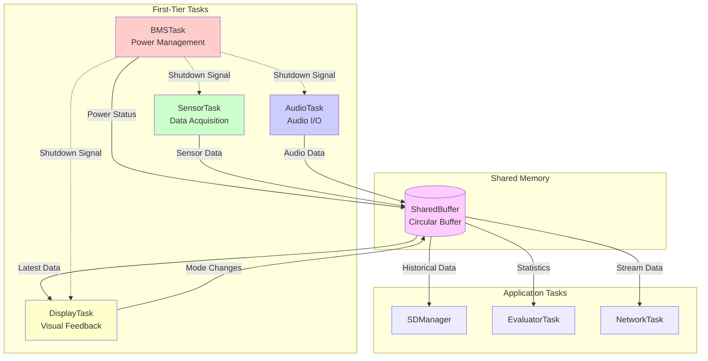

# Introduction

The Pocket Lab is the next-generation approach to science education. Designed by the Bucharest Applied STEAM Museum, it brings scientific exploration into anyone's hands. From citizen science projects to fearless exploration (guided or individual), the Pocket Lab illuminates the connections between Science, Technology, Engineering, Art, and Math in the world around us.


---

# Hardware Design

The system is built around an **ESP32-C6 MINI** microcontroller, which offers:
- Powerful processing capabilities
- WiFi and Bluetooth connectivity
- Excellent integration with accessible codebases through Arduino

The microcontroller collects data from a suite of sensors (9-DOF IMU, light, pressure, audio) and uses a chain of WS2812B RGB LEDs to relay measurements to the user. An on-board microSD card enables data logging and automated grading of student work. Everything is powered by a 3.7V LiPo cell, which is charged using the USB-C connector.
## Board ID - Education V0


### Power
The power stage is designed for a **500 mAh, 3.7V LiPo cell**. Key specifications:
- **Charger IC**: Configured to supply 450 mA in constant-current regime; stops charging when current drops below 150 mA in constant-voltage regime
- **USB-C Power**: Non-negotiated supply limited to 5V @ 500 mA (sufficient for system operation)
- **Voltage Monitor**: Prevents brown-out behavior on the ESP32 when the 3.3V rail drops below 2.9V
- **Power Latching**: A simple circuit enables and latches the LDO through push-button SW1 and an ESP32 GPIO 

### Display
The display consists of a chain of NeoPixel RGB LEDs organized across three zones:

**Mode Display (2 LEDs)** - Color-coded indication of the actively displayed quantity:
- WHITE → Light
- MAGENTA → Sound
- YELLOW → Magnetic Field
- GREEN → Acceleration
- ORANGE → Gyroscope
- RED → Air Temperature
- BLUE → Air Pressure

Additional device information is also displayed (e.g., battery state: Blinking Orange = Battery Low; Blinking Green = Charging; Blinking Blue = Fully Charged)

**Magnitude Display (3-4 LEDs)** - Conveys scalar quantities and magnitudes of vector quantities

**Direction Display (3 LEDs)** - Conveys qualitative Cartesian components (X, Y, Z) for vector quantities
- *Note: Direction Display is only available in Binary Display Mode (see Software Architecture section)*

### Sensors
The Pocket Lab EDU V0 includes the following sensors:

| Sensor | Measurements |
|--------|-------------|
| **ICM-20948** | 9-DOF IMU: translational acceleration, rotational velocity, magnetic field strength |
| **ICP-20100** | Ambient temperature and air pressure |
| **BH1750FVI** | Ambient light intensity |
| **MMICT390200012** | Microphone: sound pressure level (dB) |

### Programming
The MCU can be programmed through **Joint Download Boot Mode**:

1. Connect the Pocket Lab to a host computer using a USB-C data cable
2. Hold down **SW2** (labeled "MOD"; connected to GPIO 9)
3. While holding SW2, press and hold **SW1** (labeled "ON/OFF")
4. Release SW2 while keeping SW1 pressed
5. Release SW1

The USB-serial connection appears as `/dev/ttyACM*` (Linux) and allows PlatformIO to flash code to the ESP32-C6.

# Software Architecture

The software architecture is built around a FreeRTOS task-based design with a central `shared_data_buffer` for inter-task communication. Tasks are organized into two tiers:

## Task Organization

### First-Tier Tasks (Core System)
These tasks are **always active** and form the foundation of the Pocket Lab operation:
- **BMSTask** - Battery management and power control
- **SensorTask** - Sensor data acquisition and processing
- **AudioTask** - Audio input/output management
- **DisplayTask** - User interface via NeoPixel LEDs

### Application-Level Tasks (Feature-Specific)
These tasks are **conditionally enabled** based on active applications, demos, or features:
- **SDManager** - MicroSD card operations for data logging
- **EvaluatorTask** - Student performance assessment and grading
- **NetworkTask** - WiFi/Bluetooth connectivity features

## System Architecture Diagram


```mermaid
graph TB
    subgraph "First-Tier Tasks"
        BMS[BMSTask<br/>Power Management]
        SENSOR[SensorTask<br/>Data Acquisition]
        AUDIO[AudioTask<br/>Audio I/O]
        DISPLAY[DisplayTask<br/>Visual Feedback]
    end

    subgraph "Shared Memory"
        BUFFER[(SharedBuffer<br/>Circular Buffer)]
    end

    subgraph "Application Tasks"
        SD[SDManager]
        EVAL[EvaluatorTask]
        NET[NetworkTask]
    end

    BMS -->|Power Status| BUFFER
    SENSOR -->|Sensor Data| BUFFER
    AUDIO -->|Audio Data| BUFFER

    BUFFER -->|Latest Data| DISPLAY
    BUFFER -->|Historical Data| SD
    BUFFER -->|Statistics| EVAL
    BUFFER -->|Stream Data| NET

    BMS -.->|Shutdown Signal| SENSOR
    BMS -.->|Shutdown Signal| AUDIO
    BMS -.->|Shutdown Signal| DISPLAY

    DISPLAY -->|Mode Changes| BUFFER

    style BMS fill:#ffcccc
    style SENSOR fill:#ccffcc
    style AUDIO fill:#ccccff
    style DISPLAY fill:#ffffcc
    style BUFFER fill:#ffccff
```

## Detailed Task Descriptions
### 1. SensorTask
Responsible for initializing, managing, collecting, and processing sensor data. Pushes each new raw reading to the `shared_data_buffer`. Uses the **SensorHAL** virtual layer, as implemented in `specific_sensor_HAL`, to standardize high-level I/O across all sensors.

Furthermore, note that different sensors are sampled at different rates based on their response characteristics and application requirements.
The task maintains individual timers for each sensor and only reads when that sensor's interval has elapsed, optimizing power consumption and computational load.

#### States
* **BOOT** - Default state on boot-up; transition to INIT triggered from main.cpp
* **INIT** - Initializes I2C bus for communications to sensors, configures and confirms communications with all sensors
* **READ** - If a sensor is ready to read (based on its individual `read_rate_Hz`), captures a raw reading and commits it to the latest frame of `shared_data_buffer`

### 2. BMSTask
Responsible for managing power delivery to the Pocket Lab. Monitors battery health, informs user about remaining run-time, and handles power-up and shut-down of the entire system.

#### States
* **BOOT** - Waits until startup timer expires. Prevents accidental power-up if SW 1 is bumped.
* **STARTUP_LATCH** - Configures Charger IC monitoring pins after confirming power is latched.
* **ACTIVE** - Monitors feedback from the Charger IC & Battery Voltage predictions to infer ChargeControllerState:
    * **BATTERY_ONLY** - Charger unplugged & battery supplying power
    * **LOW_BATTERY** - Charger unplugged & battery supplying power & less than 30 minutes of battery life remaining
    * **CHARGING** - Charger connected & battery charging
    * **DONE_CHARGING** - Charger connected & supplying power to system (battery charging complete)
* **SHUTDOWN_PENDING** - When SW 1 is pressed to initiate a shut-down, the LDO is un-latched and other tasks are informed to facilitate a clean shut-down.

#### ⚠️ Known Critical Issues
The current BMSTask implementation has several critical issues that will be addressed in future revisions:
- **Limited voltage monitoring**: VBat is only checked when in `BATTERY_ONLY` state, missing voltage drops during charging or when connected to USB
- **No automatic low-voltage disconnect**: The system does not automatically disconnect power when VBat drops dangerously low, risking deep discharge that could trigger the battery's undervoltage lockout protection

### 3. AudioTask
Manages audio input and output operations for the Pocket Lab. The AudioTask is responsible for interfacing with the microphone sensor (MMICT390200012) and any future audio peripherals through a Hardware Abstraction Layer (HAL).
This decouples high-level audio processing from hardware-specific implementations, allowing to scale audio I/O in the future.
Like the SensorTask, the AudioTask writes processed audio data (e.g., sound pressure level in dB, frequency analysis) to the `shared_data_buffer`.

#### States
* **BOOT** - Default state on boot-up; transition to INIT triggered from main.cpp
* **INIT** - Initializes audio peripherals through the AudioHAL, configures sampling parameters
* **SAMPLING** - Actively captures audio data at the configured sample rate, processes it, and commits results to `shared_data_buffer`
* **IDLE** - Audio acquisition paused (e.g., during low-power modes or when no audio display is active)

### 4. DisplayTask
Manages the primary user feedback tool, the chain of NeoPixels. A push-button (SW 2 - display mode button) is debounced and used to cycle through DisplayStates. The current DisplayState is color-coded into the **Mode Display**.

#### States
* **BOOT** - Default state on boot-up; transition to INIT triggered from main.cpp
* **INIT** - Initializes the RGB LED strip and displays a color code for the GIT SHA (used to confirm proper code version is running)
* **DISPLAY_XX** - Pulls the latest value for the XX quantity from `shared_data_buffer`. Updates the **Magnitude Display** and **Mode Display** to reflect the measurement.

The DisplayTask supports two distinct visualization modes selected at boot time by holding (or not holding) the display mode button:

#### Visualization Modes - VU

VU mode provides a classic "volume unit" meter visualization reminiscent of analog audio equipment. In this mode, scalar measurements are displayed as a horizontal bar graph using 6 magnitude LEDs. The display shows the normalized percentage of the measurement relative to predefined min/max thresholds for each sensor type.

The magnitude LEDs use a gradient color scheme that transitions smoothly from green (low values) through yellow (mid-range) to red (high values), providing an intuitive visual indication of intensity. The more LEDs that are lit, the closer the measurement is to its maximum threshold. Vector quantities in VU mode display only their magnitude - no directional information is shown.

#### Visualization Modes - Binary (Integer Encoding)

Binary mode takes a fundamentally different approach by encoding the actual integer value of measurements rather than showing a percentage. This mode provides precise numerical information that can be decoded by reading the LED colors, making it particularly useful for debugging and data verification.

The system uses 4 magnitude LEDs to encode 12-bit values (0-4095) using a novel 3-bit-per-LED color encoding scheme:

**How Binary Encoding Works:**

Each RGB LED encodes 3 bits of information using its individual color channels:
- Blue channel = Bit m (LSB for that LED)
- Yellow channel = Bit m+1 (middle bit)
- Red channel = Bit m+2 (MSB for that LED)

The LEDs are arranged from left to right, with LED #1 (leftmost) showing bits 0-2, LED #2 showing bits 3-5, LED #3 showing bits 6-8, and LED #4 (rightmost) showing bits 9-11. This arrangement means that more LEDs being lit indicates a larger magnitude.

**Color Combinations:** The 3 bits per LED create 8 possible states (0-7), each displayed as a distinct color:
- `000` → OFF
- `001` → BLUE (bit 0 only)
- `010` → YELLOW (bit 1 only)
- `011` → GREEN (bits 0+1: blue+yellow = green)
- `100` → RED (bit 2 only)
- `101` → PURPLE (bits 0+2: blue+red = purple)
- `110` → ORANGE (bits 1+2: yellow+red = orange)
- `111` → WHITE (all three bits active)

**Example:** To encode the value 1059:
- 1059 in binary = `0100 0010 0011` = 2⁰ + 2¹ + 2⁵ + 2¹⁰
- LED #1 (bits 0-2 = `011`): Blue + Yellow = **GREEN**
- LED #2 (bits 3-5 = `100`): Red only = **RED**
- LED #3 (bits 6-8 = `000`): All off = **OFF**
- LED #4 (bits 9-11 = `100`): Red only = **RED**

Before encoding, sensor readings are multiplied by sensor-specific scaling factors (defined as `BINARY_MAG_ORDER_*` constants) to convert floating-point measurements into integer values. For example, temperature is multiplied by 10, so 25.3°C becomes 253, while pressure is multiplied by 10, converting 101.32 kPa to 1013 (then clamped to 4095). Note that acceleration and gyro measurements are very noisy and flicker significantly; the first two bits are masked, effectively rounding every measurement to a multiple of 4.

**Direction Display:**

Binary mode also displays vector components (X, Y, Z) using 3 dedicated direction LEDs. Each LED shows its component using a color gradient:
- **RED** → Negative values
- **OFF** → Near-zero values (±5% dead zone)
- **GREEN** → Positive values

The intensity of the color fades proportionally with the component's magnitude, providing both sign and strength information. 


## Application-Level Task Details

### 5. EvaluatorTask
Responsible for gauging user effort and measuring learning outcomes. The EvaluatorTask owns multiple instances of the abstract base class `EvaluatorBase`.

`EvaluatorBase` standardizes I/O across all evaluators, such as `DisplaySessionEvaluator` (which captures aggregate statistics on sensor data while a specific DisplayTask mode is active). This enables automated grading and feedback for educational activities.

#### States
* **BOOT** - Default state on boot-up; transition to INIT triggered from main.cpp
* **INIT** - Initializes and confirms appropriate logging is set up for all evaluators
* **RUNNING** - Checks progress on all evaluators and manages access to the SDManager queue for data logging
* **ERROR** - Error handling (not yet implemented)

### 6. SDManager
Owns operation of the microSD card. It manages access to the storage resource using a separate state machine, handling concurrent read/write requests from multiple tasks.

#### States
* **BOOT** - Default state on boot-up; transitions to INIT automatically after initializing SD queue
* **WAIT_FOR_INSERT** - Checks and debounces the state of the SD card detect GPIO
* **MOUNTING** - Starts SPI communications, mounts the SD card, and checks SD card metadata
* **READY** - Allows fulfillment of read/write requests in the queue
* **UNMOUNTING** - Unmounts the SD card if removal is detected
* **ERROR** - Error handling (not yet implemented)

### 7. NetworkTask
Manages WiFi and Bluetooth connectivity features. This task is enabled when network-based applications are active (e.g., data streaming, remote monitoring, firmware updates).

*Note: Full NetworkTask implementation details are under development.*

---

# SD Card Formatting

In order to read and write to the SD card, it must be formatted to **FAT32** with an **MBR** partition table.

## Formatting Instructions (Linux)

1. Insert the microSD card into a compatible card reader, connect to a Linux machine, and locate the device:
```bash
lsblk
```

2. Unmount any existing partitions and clear the card (replace `/dev/sdX` with your device):
```bash
sudo umount /dev/sdX*
sudo wipefs --all /dev/sdX
sudo fdisk /dev/sdX
```

3. Within `fdisk`, configure the following:
   - Press **`o`** → Create a new DOS (MBR) partition table
   - Press **`n`** → Create a new primary partition
   - Accept all defaults (press Enter)
   - Press **`t`**, then type **`c`** → Change partition type to W95 FAT32 (LBA)
   - Press **`w`** → Write changes and exit

4. Format the partition to FAT32:
```bash
sudo mkfs.vfat -F 32 -n SDCARD /dev/sdX1
```

The SD card is now ready for use with the Pocket Lab. 