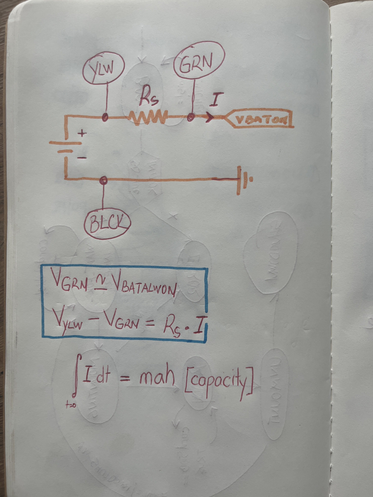
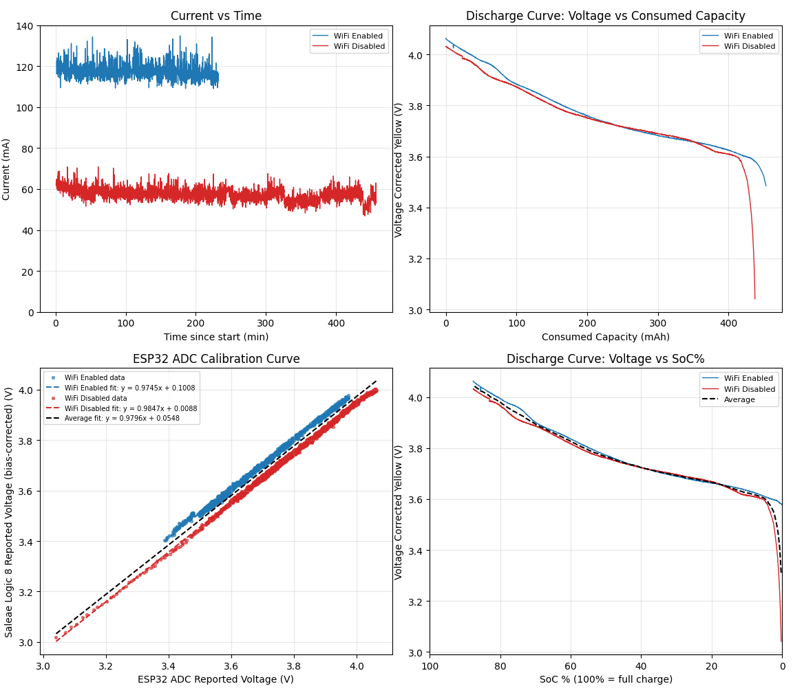

# Introduction

The Hardware Bringup folder features test campaigns and resources used throughout the development of the Pocket Lab platform. 

---

## LiPo Battery Characterization

The Pocket Lab is powered by a 3.7V LiPo pouch cell. Safe operation of this cell is enabled by a Battery Management IC, the [BQ24040](https://www.ti.com/lit/ds/symlink/bq24040.pdf?ts=1783749675991) chip by Texas Instruments. While the chip reports battery charging / discharging state to the microcontroller via two open-drain outputs, estimating State-of-Charge (SoC) is left up to the user.
For this purpose, the system includes a voltage divider which steps the battery voltage down to the range readable by the ESP32's internal 12-bit ADC, 1.1V.
Finally, after this voltage reading is scaled back up to the battery's voltage, it needs to be translated into a State of Charge value, similar to the fuel gauge on your car, or the battery percentage on your smartphone.

### Goals and Experimental Setup
This test campaign attempted to:
1. Calibrate the ESP32's ADC Voltage readings of ***VBAT_ALW_ON*** against a high-precision instrument
2. Determine the Voltage - State of Charge relationship for the [KRL502340 500 mAh LiPo cell](https://www.alibaba.com/product-detail/High-Quality-502340-500Mah-Electric-Bicycle_1601204689828.html) used on the Pocket Lab EDU V0. 

**The experimental setup and analysis methods are well documented in this [application note](https://www.ti.com/lit/an/sluaaa1/sluaaa1.pdf?ts=1783827079314) by Texas Instruments.**

To measure battery voltage and current, a [Saleae Logic 8](https://www.saleae.com/products/logic-8) was used in conjunction with a 1 Ohm (1%) shunt resistor. The decision to use a logic analyzer (LA) was motivated by the phenomenal [Logic 2 Automation API](https://saleae.github.io/logic2-automation/) which enabled automatic data capture. Raw data was collected through two LA analog channels (YELLOW and GREEN), together with the ESP32's ADC measurement of *VBAT_ALW_ON*.

Two test conditions were considered - with and without the ESP32's WiFi Modem enabled. Then, both tests were run from a fully charged battery (charged by the on-board BQ24040) until the on-board under-voltage lockout monitor (UVLO) (calibrated to trigger when *VBAT_ALW_ON* drops below 2.9V) removed power from the MCU. 

Data captures were made every 10 seconds, for one second, at a sample rate of 50Hz. All resulting 50 samples were averaged to generate one data-point every 10 seconds.

### Results

1. The ESP32 ADC reliable measures Battery Voltage within 3%.
2. For potentials above 3.6V, the **battery exhibits an almost-linear discharge profile**.
3. Although the rated charged voltage for this battery is 4.2V, the **maximum charge voltage reported across both tests does not exceed 4.06V**. This is likely due to the battery's internal resistance which leads to voltage sag while pulling current, or to a mis-configured battery charging IC which never tops off charge for the LiPo. 
4. While observing sample data collected at a higher rate (10 kHz), large current spikes were observed when the ESP32's WiFi Modem was enabled. In turn, large voltage dips on the *VBAT_ALW_ON* bus, especially toward the lower end of the battery's capacity envelope,  triggered the 2.9V UVLO sooner than in the WiFi-OFF test. This results in **unreliable operation below an average battery voltage of 3.5V when the WiFi Modem is enabled**.
5. Across both discharge tests, **capacities of 437 and 452 mAh respectively were estimated**. This is likely a cumulation between bullet point 2. (see above) and the little capacity left in the battery when the UVLO triggered, thus ending the test. In other words, the HW configuration yields a **usable capacity of approx. 87% for the 500mAh cell**. 

### Conclusions
1. Battery Voltage is corrected from the ADC's measurement using the formula 
> V_BAT_ADJUSTED = V_ADC_MEASURED * 0.9796 + 0.0548
2. To enable reliable operations with and without WiFi enabled, the **usable Battery Voltage range was limited to 3.6 - 4.2 V**.
3. This range was mapped to a 0 - 100% SoC range and implemented using a look-up table. 
> ESTIMATED_SOC = fn (V_BAT_ADJUSTED)

### Limitations

* This method for determining SoC from Voltage assumes a very low discharge rate, compared to the battery's C rating. In our case, when operating at 120 mA, that represents a 0.24C discharge.

### Resources
* As always, full datasets, and analysis scripts are available inside the ***lipo_discharge_curve*** directory.
